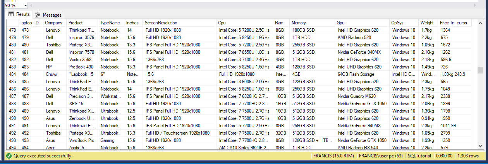
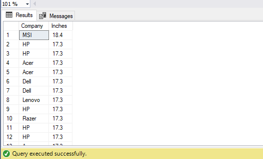

# SQL-Cleaning-and-Exploratory-Data-Analysis.

 
---
 # Introduction
 This is a SQL project on laptop_price dataset. The aim of the project is to show data analysis cleaning using SQL queries and exploratory data analysis to analyse and derive insights to answer important questions for customers satisfaction.

 # Problem Task
 1. Data Cleaning of laptop_price dataset
 2. Exploratory data analysis on Laptop_price dataset

# Skills Demonstrated
* Good understanding and Navigation on Microsoft SQL Server Management Studio
* Uses of clauses
* Data cleaning

  # Data Sourcing
  The dataset laptop price was gotten and downloaded from kaggle.

  # Data Cleaning
  After Importing the dataset into MySQL. I used the query to view the dataset

  select *
from [dbo].[Laptop_price]

The database showed that the number of rows is 1303 but laptop_ID ends with 1320. on investigation, I observed that some numbers were skipped while entering the dataset. To correct the numbering serially from 1-1303, I used the query below

WITH NewSequence AS

(
  SELECT
    laptop_ID, 
    ROW_NUMBER() OVER (ORDER BY laptop_ID) as Laptop_ID_New
  FROM [dbo].[Laptop_price]
)

UPDATE NewSequence  
SET laptop_ID = Laptop_ID_New;

On inspection on the Product column, I observed some entries in in bracket in some of the rows in the Product column. These entries were already in different columns of the dataset.

select Product
  from [dbo].[Laptop_price]
  

To solve the issue, I used the query below

(a) To remove those entries in bracket  
   
   SELECT
    CASE
        WHEN CHARINDEX('(', Product) > 0 THEN
            SUBSTRING(Product, 1, CHARINDEX('(', Product) - 1)
        ELSE
            Product
    END AS Separated_Name
FROM [dbo].[Laptop_price]

(b) To Update the dataset with the clean Product column

update [dbo].[Laptop_price]
set Product = 
CASE
        WHEN CHARINDEX('(', Product) > 0 THEN
            SUBSTRING(Product, 1, CHARINDEX('(', Product) - 1)
        ELSE
            Product
    END
    
  

In the same Product column, I observed some entries with quotation marks. Take a look at laptop_ID number 15 

To resolve this, I used the query 

(a) removes such that entries

SUBSTRING(Product, 1, CHARINDEX('""', Product)) as Separated_Name
from [dbo].[Laptop_price]

(b) Updates the dataset with the clean Product column 

UPDATE [dbo].[Laptop_price]
SET Product = REPLACE(REPLACE(Product, '" "', ''), ' 12', '')
WHERE Product LIKE '%"%12%';

When I selected the lapt_ID and Price_in_euros and order in descending, I observed the first laptop_ID 484 has two entries 

select  laptop_ID, Price_in_euros
from [dbo].[laptop_price (1)]
order by Price_in_euros Desc

I scrolled down the dataset to check entries in laptop_ID 484, I observed that entries were misarranged in the row compared to other laptop_IDs.

since it was only on laptop_ID 484, I had to place the entries in the correct column along the row, using the query

update [dbo].[Laptop_price]
  set Company = 'Chuwi', Product = 'Lapbook', TypeName = 'Notebook', Inches = 15.6, 
  ScreenResolution = 'full HD 1920x1080', Cpu = 'Intel Atom x5-Z8350 1.44GHz',
  Ram = '4GB', Memory = '64GB Flash Storage', Gpu = 'Intel HD Graphics', OpSys = 'Windows 10',
  Weight =  '1.89kg', Price_in_euros = 2489
  where laptop_ID = 484
  

  I checked for duplicate values, but didn't find any. This shows that entries are unique with respect to laptop_ID.
  
  select  laptop_ID, Company, Ram, Memory, count(*) as quantity
from [dbo].[Laptop_price]
group by  laptop_ID, Company, Ram, Memory 
Having count(*) >1

At this point I could say I was good to go for Exploratory Data Analysis.

# Exploratory Data Analysis of Laptop_price and Specifications
1. The price used in the dataset is in Euros. I had to add a new column called 'Price_in_Naira'. This will enable customers from Nigeria know the cost of a laptop at a glance without trying to convert from Euros to Naira.

2. ALTER TABLE [dbo].[Laptop_price]
   ADD Price_in_Naira FLOAT
   

3. Converting Price_in_euros to Price_in_Naira using exchange rate 910

   update [dbo].[Laptop_price]
   set Price_in_Naira = CAST(Price_in_euros as FLOAT) * 910
   

4. To determine the types of Company and give their totalnumber

   select distinct Company, count(Company) as Totalnumber
   from [dbo].[Laptop_price]
   group by Company
   

5. To order the Company according to the Inches

   select Company, Inches 
   from [dbo].[Laptop_price]
   order by Inches desc
   

6. To determine the Company cost with some specifications

   select Company,Price_in_Naira, Ram, Memory, Inches, Weight, OpSys, TypeName, Cpu
   from [dbo].[Laptop_price]
   order by Price_in_Naira desc
   

7. Getting the Minimum cost of each Company

  select Company, min(Price_in_Naira) as Less_Expensive
  from [dbo].[Laptop_price]
  group by Company
  order by min(Price_in_Naira) desc

8. Getting the Maximum cost of each Company

   select Company, max(Price_in_Naira) as Expensive
   from [dbo].[Laptop_price]
   group by Company
   order by max(Price_in_Naira) desc

9. To determine product and TypeName under Apple
    
   select distinct Product, TypeName
   from [dbo].[laptop_price (1)]
   where Company = 'Apple'

10. To determine Ram and how many the are in Apple
    
    select Ram, Count(Ram) as CountRam
    from[dbo].[laptop_price (1)]
    where Company = 'Apple'
    group by Ram

11. Specified a condition which classify Apple Price as Costly and Cheap

    select Ram, Product, Price_in_Naira,
case 
			when Price_in_Naira > 1000000 then 'Costly'
			else 'Cheap'
end as Classification

    from [dbo].[laptop_price (1)]
    where Company = 'Apple'
    order by Price_in_Naira desc

# Conclusion

1. There are 19 Company with Lenovo having the highest count.
2. The Company MSI has the highest Inche of 18.4
3. Razer Company has the most expensive laptop while Acer Company has the less_expensive laptop.
4. Macbook Air Apple laptops are cheap compare to the other Apple products.

# Recommendation

For a customer to consider which purchase choice to make, he/she must consider some important specifications such 
as: Inche, Ram, Cpu, Memory and Price. 
